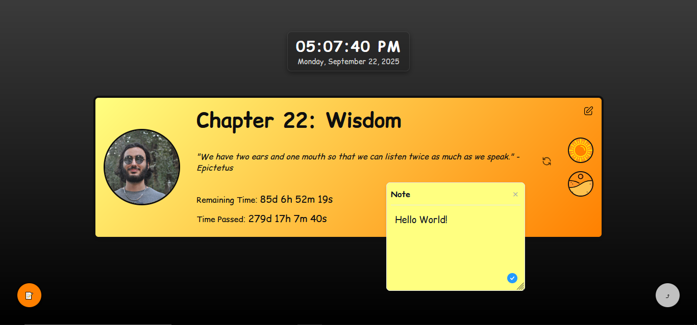

# COYL - Chapter of Your Life

Welcome to **COYL**, a simple and beautiful dashboard that turns your life into a dynamic, archetypal story. It's a place to reflect on your current chapter, connect with powerful symbols, and never forget the hero of your own epic tale—you!

---

### 🤔 What is COYL?

Have you ever felt like you're living through a specific "chapter" of your life? COYL is a web application designed to capture that feeling. It's a personal, visual dashboard that helps you:

* **Define Your Current Chapter:** Give a name to the period of your life you're in right now.
* **Connect with Archetypes:** Choose a symbolic location and a personal symbol that resonate with where you are on your journey.
* **Visualize Your Time:** See a live countdown of the days remaining in your current year of life, and the days that have passed, reminding you to make each one count.
* **Stay Inspired:** Get a daily stoic quote to keep you grounded and motivated.

It’s a private space to see your life's narrative unfold in a creative and meaningful way.

---

### 💖 Why Was This Project Created?

I've always had this idea of viewing life through a more epic, story-driven lens. We all have powerful symbols and mental "locations" that define our inner state, but it's easy to lose track of them in the hustle of daily life.

I wanted to create an easily accessible, beautiful visual that could capture my mental and emotional state, using the power of archetypes. It’s dynamic, it changes as you change, but it’s always there to remind you of your story, your character, and your personal power.

Plus, it was a fun project to build!

---

### 🚀 How to Use COYL

Getting started is simple. Everything happens right in your browser, and no data ever leaves your computer.

1.  **Create Your Archetype:**
    * On your first visit, you'll be taken to the "Archetype Creator."
    * Fill in your **Date of Birth**, give a **Name** to your current life chapter, and choose an **Archetypal Location** and **Symbol** that feel right for you right now.
    * You can optionally upload a photo to represent you (it can be anything you like!).

2.  **Explore Your Dashboard:**
    * Your main dashboard will now display your chapter, your chosen symbols, and a live countdown.
    * Click on your archetype symbols to read a detailed description of what they represent.
    * Click the refresh button next to the quote to get a new one.

3.  **Customize Everything!**
    * Click the **"Theme"** button to open the theme editor.
    * Here, you can change all the colors—from the background gradients to the text, borders, and buttons—to make the dashboard truly your own.

4.  **Use Sticky Notes:**
    * Click the 📝 icon to enter "Sticky Note Mode."
    * Click anywhere on the screen to create a sticky note for your thoughts, goals, or reminders. You can drag, resize, and edit them as you please.

5.  **Backup Your Data:**
    * Your data is stored locally in your browser. Use the **"Export"** button to download a backup file of your settings.
    * If you ever clear your browser data or move to a new computer, you can use the **"Import"** button to restore everything instantly.

---

### ✨ Features

* **Dynamic Dashboard:** See your life's current chapter, age, and a live countdown.
* **Archetype System:** Choose from a rich set of symbolic locations and personal symbols.
* **Full Theme Customization:** Complete control over colors, backgrounds, and fonts.
* **Sticky Notes:** A simple, elegant system for jotting down your thoughts.
* **Daily Stoic Quotes:** A new piece of wisdom delivered to your dashboard every day.
* **100% Private:** All your data is stored locally in your browser's localStorage. Nothing is ever uploaded to a server.
* **Import/Export:** Easily back up and restore your personal setup.

---

### 🔒 Privacy

Your privacy is paramount. **COYL runs entirely in your web browser.** All the information you enter—your date of birth, chapter name, photos, and notes—is stored locally on your computer. It is never sent over the internet and is not accessible by anyone else.

---

### 🛠️ Tech Stack

This project is built with vanilla **HTML**, **CSS**, and **JavaScript**—no frameworks, no libraries, just the core technologies of the web.

---

### 🙏 Acknowledgements

* **[SVGRepo](https://www.svgrepo.com/)** for providing the beautiful and high-quality SVG icons used throughout the application.
* **[Stoic Quotes API](https://github.com/benhoneywill/stoic-quotes)** for their free and simple API that delivers daily wisdom to the dashboard.

---

### 📜 License

This project is open-source and available under the MIT License. You can find the full license text in the [LICENSE](LICENSE) file.

---

#### *All the contributes are welcome! :)*